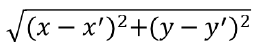
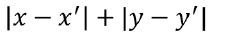
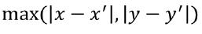
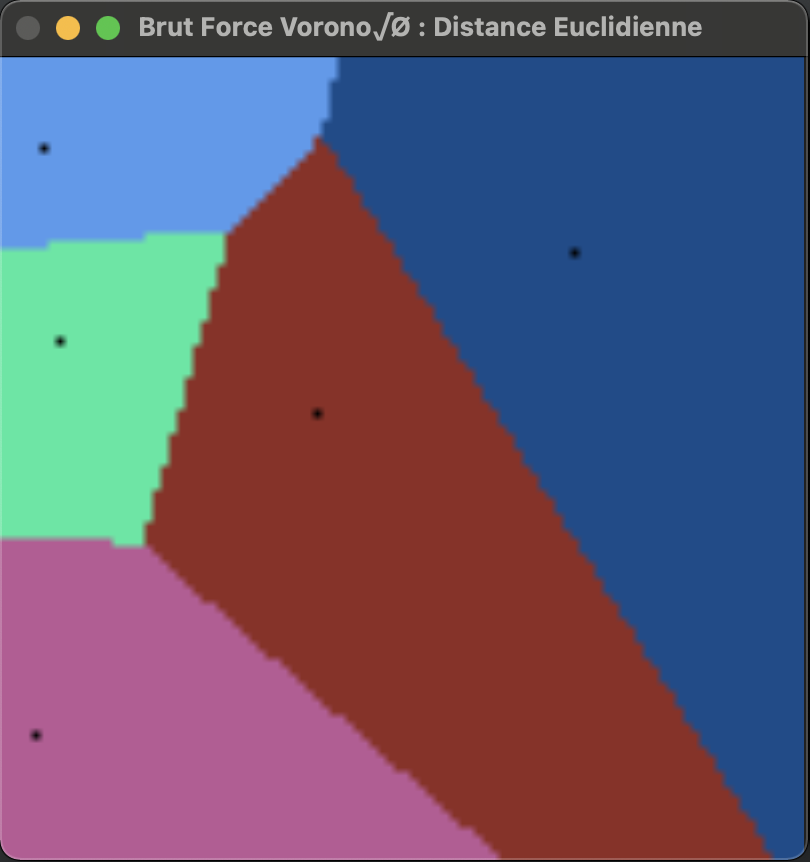
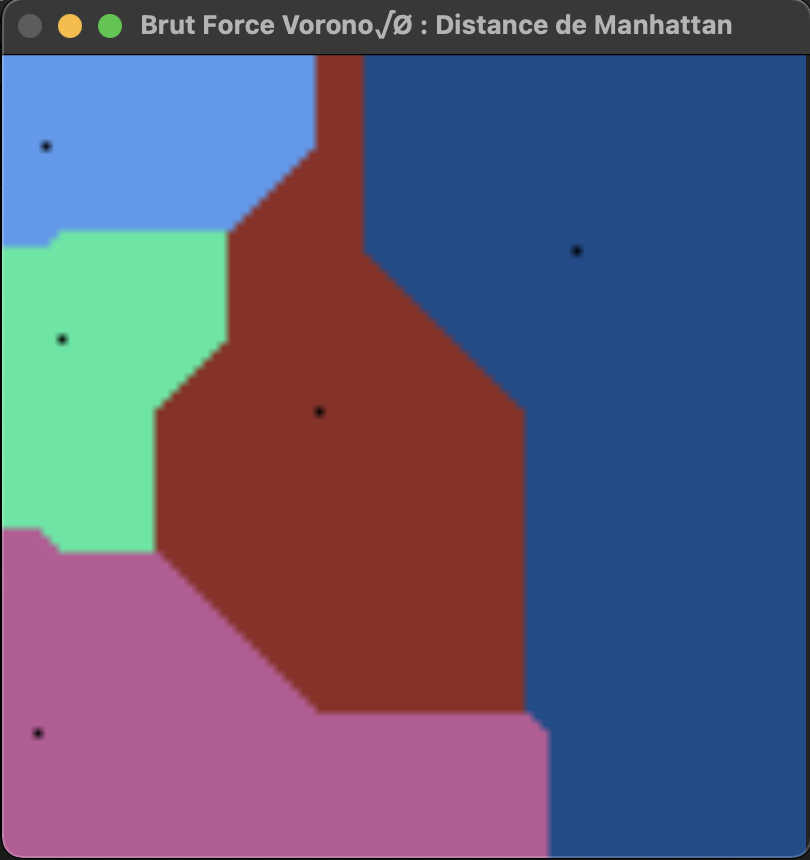
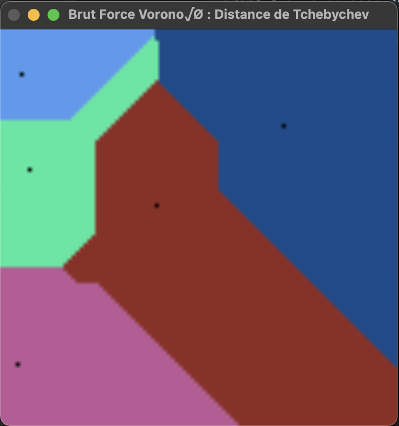

# VORONOÏ DIAGRAM

# DIAGRAM DE VORONOÏ DISCRET
## ALGO DE FORCE BRUTE
```
Image size = 100 x 100 pixel
Nombre de point = 5
```
|    |Euclidienne|Manhattan|Tchebychev|
|:--:|:--:|:--:|:--:|
|Equation||||
|Resultat||||